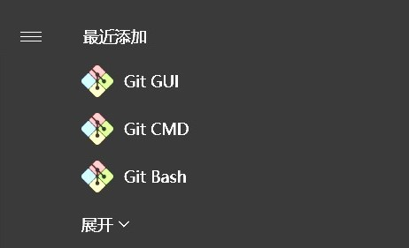
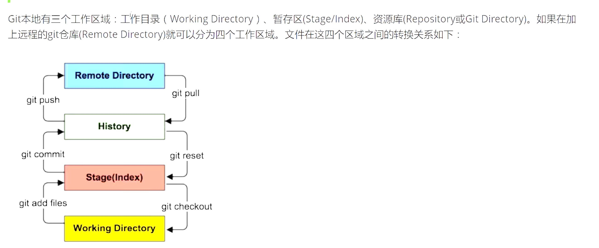
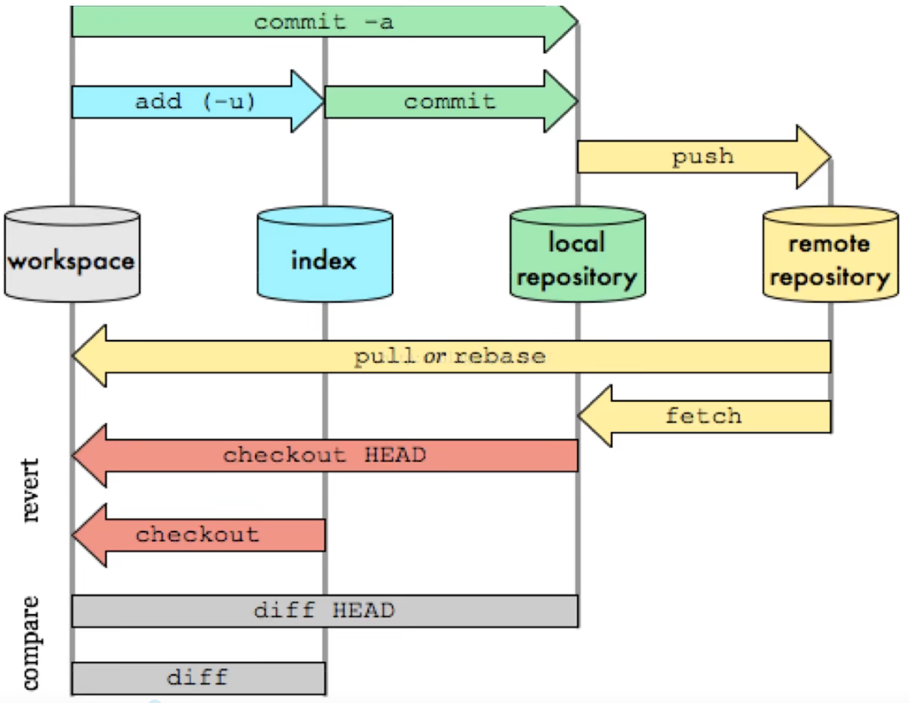
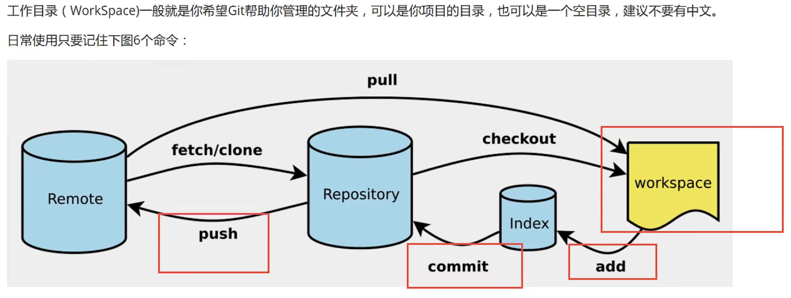

# Git
## 1.版本控制
### 1.1 Git和SVN最主要的区别（面试常考）

SVN是**集中式版本控制系统**，版本库是集中放在**中央服务器**的，而工作的时候，用的都是自己的电脑，所以首先要从中央服务器得到最新的版本，然后工作，完成工作后，需要把自己做完的活推送到中央服务器。集中式版本控制系统是必循联网才能工作，对网络带宽要求比较高

Git是**分布式版本控制系统**，没有中央服务器，每个人的电脑就是一个完整的版本库，工作的时候无需联网。协同的方法是这样的：当你在自己的电脑上修改了文件A，其他人也修改了文件A，只需互相把各自的修改push给对方，就可以互相看到对方的修改了
但是每个人都有完整的代码，可能会有安全隐患  
==Git是目前世界上最先进的分布式版本控制系统==

## 2.安装

安装软件后有三个程序，分别是

**Git Bash**：Linux风格的命令行
**Git CMD**：Windows风格的命令行
**Git GUI**：图形界面的Git

### 2.1必要配置

查看配置
~~~git
git config -l
~~~

查看系统配置
~~~git
git config --system --list
~~~

查看用户配置
~~~git
git config --global --list
~~~

==安装后的第一步就是设置用户名和邮箱==
~~~git
git config --global user.name "用户名"
git config --global usern.email "邮箱"
~~~

## 3.Git基本理论（核心）

>工作区域

Workspace：工作区，平时存放项目代码的地方  
Index/Stage：暂存区，用于临时存放改动，事实上它只是一个文件，保存即将提交到文件列表的信息  
Repository：仓库区（或者本地仓库），就是安全存放数据的位置，这里有你提交到所有版本的数据。其中Head指向最新放入仓库的版本  
Remote：远程仓库，托管代码的服务器。  

>工作流程

git的工作流程一般是这样的：
1.在工作目录中添加、修改文件；  
2.将需要进行版本管理的文件放入暂存区域；  
3.将暂存区域的文件提交到git仓库。  

因此，git管理的文件有三种状态：==已修改（modified）、已暂存（staged）、已提交（committed）==

## 4.Git项目搭建

>创建工作目录与常用命令

创建本地仓库的方法有两种：一种是创建全新的仓库，另一种是克隆远程仓库

>创建全新仓库

1、创建全新的仓库，需要在需要管理的项目根目录执行Git命令：
~~~git
//在当前目录新建一个Git代码库
git init
~~~
2、执行后可以看到，多出一个隐藏的.git文件夹。

>克隆远程仓库

将远程服务器上的仓库完全镜像到本地
~~~git
//克隆一个项目和它的整个代码历史（版本信息）
git clone [需要克隆的仓库的网址]
~~~

## 5.Git文件操作

>文件4种状态

版本控制就是对文件的版本进行控制，要对文件进行修改、提交等操作，首先要知道文件当前处于什么状态

**Untracked**：未跟踪，此文件在文件夹中，但并没有加入到git库中，不参与版本控制，通过==git add==命令，状态变为==Staged==
**Unmodify**：文件已经入库，未修改，即版本库中的文件快照内容与文件夹中完全一致，这种类型的文件有两种去处，如果它被修改，而变为==Modified==，如果使用==git rm==移出版本库，则变为==Untracked==文件
**Modified**：文件已修改，仅仅是修改，并没有进行其他的操作，这个文件也有两个去处，通过==git add==可进入暂存==Staged==状态，使用==git checkout==则丢弃修改，返回到==Unmodify==状态，这个==git checkout==即从库中取出文件，覆盖当前修改！
**Staged**：暂存状态。执行==git commit==则将修改同步到库中，这时候库中文件与本地文件又变为一致，文件变为==Unmodify==状态。执行==git reset HEAD filename==取消暂存，文件状态为==Modified==

>查看文件状态
~~~git
//查看指定文件状态
git status [filename]

//查看所有文件状态
git status

git add .             //添加所有文件到暂存区  
git commit -m "内容"  //提交暂存区中的内容到本地仓库
~~~

>忽略文件

有时候我们不想把某些文件纳入版本控制中，可在主目录下建立".gitignore"文件，该文件有如下规则

1.忽略文件中的空行或以"#"开始的行会被忽略  
2.可以使用Linux的通配符。例如"*"表示任意多个字符，"?"表示一个字符  
3.如果名称的最前面有一个"!"，表示例外规则，将不被忽略  

~~~
*.txt    //忽略所有以.txt结尾的文件
!lib.txt //但lib.txt除外
/temp    //忽略根目录下的其他文件夹，不包括temp目录
build/   //忽略build/目录下的所有文件
~~~

## 6.Git中的分支

~~~git
//列出所有本地分支
git branch

//列出所有远程分支
git branch -r

//新建一个分支，但依然停留在当前分支
git branch [branch_name]

//新建一个分支，并切换到该分支
git checkout -b [branch]

//合并指定分支到当前分支
git merge [branch]

//删除分支
git branch -d [branch_name]

//删除远程分支
git push origin --delete [branch_name]
git branch -dr [remote/branch]
~~~

## 7.结尾

学习Git，最重要的是在日常中使用它，从而会越发熟练  
附上学习网站  
https://learngitbranching.js.org/?locale=zh_CN
