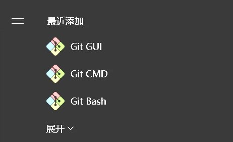
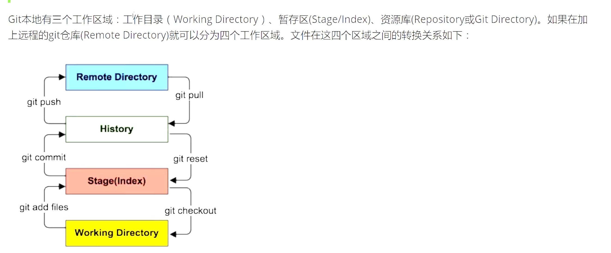
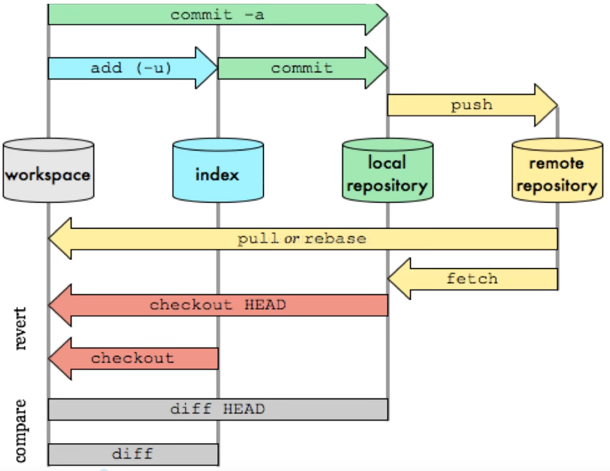
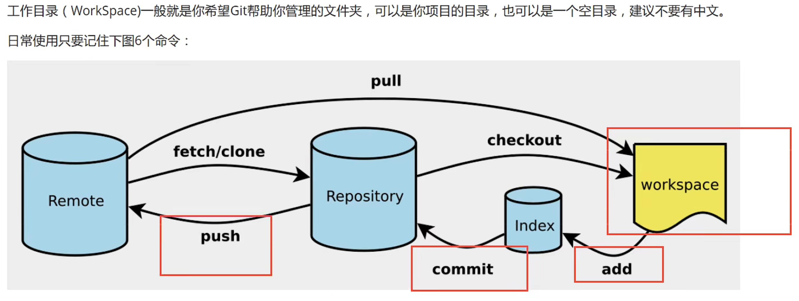

# GitStudy
学习Git的笔记 

## 一.版本控制
### 1.1 Git和SVN最主要的区别（面试常考）

SVN是**集中式版本控制系统**，版本库是集中放在**中央服务器**的，而工作的时候，用的都是自己的电脑，所以首先要从中央服务器得到最新的版本，然后工作，完成工作后，需要把自己做完的活推送到中央服务器。集中式版本控制系统是必循联网才能工作，对网络带宽要求比较高。

Git是**分布式版本控制系统**，没有中央服务器，每个人的电脑就是一个完整的版本库，工作的时候无需联网。协同的方法是这样的：当你在自己的电脑上修改了文件A，其他人也修改了文件A，只需互相把各自的修改push给对方，就可以互相看到对方的修改了。但是每个人都有完整的代码，可能会有安全隐患 。 
`Git是目前世界上最先进的分布式版本控制系统`

## 二.安装

安装软件后有三个程序，分别是：



* **Git Bash**：Linux风格的命令行  
* **Git CMD**：Windows风格的命令行  
* **Git GUI**：图形界面的Git  

### 2.1必要配置

查看配置
~~~git
git config -l
~~~

查看系统配置
~~~git
git config --system --list
~~~

查看用户配置
~~~git
git config --global --list
~~~

`安装后的第一步就是设置用户名和邮箱`

~~~git
git config --global user.name "用户名"
git config --global usern.email "邮箱"
~~~

删除某个配置
~~~git
git config --global --unset user.name //删除用户名
~~~

## 2.2 github设置添加ssh

##### 1、首先需要检查你的电脑是否已经有ssh key

运行git bash，输入如下代码。

~~~git
cd ~/.ssh
ls
~~~

这两个命令就是检查是否已经存在**id_rsa.pub**或者**id_dsa.pub**文件，如果文件已经存在，那么你可以跳过步骤2，直接进入步骤3。

PS：如果提示没有.ssh目录，请手动创建。

##### 2、创建一个ssh key

~~~
ssh -keygen -t rsa -C "your_email@example.com"
~~~

代码参数含义：

-t 指定密钥类型，默认是 rsa ，可以省略。
-C 设置注释文字，比如邮箱。
-f 指定密钥文件存储文件名。

以上代码省略了 -f 参数，因此，运行上面那条命令后会让你输入一个文件名，用于保存刚才生成的 SSH key 代码，如：

~~~
Generating public/private rsa key pair.
# Enter file in which to save the key (/c/Users/you/.ssh/id_rsa): [Press enter]
~~~

当然，你也可以不输入文件名，使用默认文件名（推荐），那么就会生成 id_rsa 和 id_rsa.pub 两个秘钥文件。


接着又会提示你输入两次密码（该密码是你push文件的时候要输入的密码，而不是github管理者的密码），

当然，你也可以不输入密码，直接按回车。那么push的时候就不需要输入密码，直接提交到github上了，如：

~~~
Enter passphrase (empty for no passphrase): 
# Enter same passphrase again:
~~~

接下来，就会显示如下代码提示，如：

~~~
Your identification has been saved in /c/Users/you/.ssh/id_rsa.
# Your public key has been saved in /c/Users/you/.ssh/id_rsa.pub.
# The key fingerprint is:
# 01:0f:f4:3b:ca:85:d6:17:a1:7d:f0:68:9d:f0:a2:db your_email@example.com
~~~

当你看到上面这段代码的收，那就说明，你的 SSH key 已经创建成功，你只需要添加到github的SSH key上就可以了。

##### 3、添加你的 SSH key 到 github上面去

**a、**首先你需要拷贝 id_rsa.pub 文件的内容，你可以用编辑器打开文件复制，也可以用git命令复制该文件的内容，如：

```
clip < ~/.ssh/id_rsa.pub
```

Window 使用 clip 命令复制，Mac 则使用 pbcopy 命令，也可以手动打开 **id_rsa.pub** 进行复制。

**b、**登录你的github账号，从右上角的设置（ [Account Settings](https://github.com/settings) ）进入，然后点击菜单栏的 SSH key 进入页面添加 SSH key。


**c、**点击 Add SSH key 按钮添加一个 SSH key 。把你复制的 SSH key 代码粘贴到 key 所对应的输入框中，记得 SSH key 代码的前后不要留有空格或者回车。当然，上面的 Title 所对应的输入框你也可以输入一个该 SSH key 显示在 github 上的一个别名。默认的会使用你的邮件名称。

##### 4、测试一下该SSH key

在git Bash 中输入以下代码

```
ssh -T git@github.com
```

当你输入以上代码时，会有一段警告代码，如：

```
The authenticity of host 'github.com (207.97.227.239)' can't be established.
# RSA key fingerprint is 16:27:ac:a5:76:28:2d:36:63:1b:56:4d:eb:df:a6:48.
# Are you sure you want to continue connecting (yes/no)?
```

这是正常的，你输入 yes 回车既可。如果你创建 SSH key 的时候设置了密码，接下来就会提示你输入密码，如：

```
Enter passphrase for key '/c/Users/Administrator/.ssh/id_rsa':
```

当然如果你密码输错了，会再要求你输入，知道对了为止。

注意：输入密码时如果输错一个字就会不正确，使用删除键是无法更正的。

密码正确后你会看到下面这段话，如：

```
Hi username! You've successfully authenticated, but GitHub does not
# provide shell access.
```

如果用户名是正确的,你已经成功设置SSH密钥。如果你看到 “access denied” ，者表示拒绝访问，那么你就需要使用 https 去访问，而不是 SSH 。

## 三.Git基本理论（核心）

>工作区域



* **Workspace**：工作区，平时存放项目代码的地方  
* **Index/Stage**：暂存区，用于临时存放改动，事实上它只是一个文件，保存即将提交到文件列表的信息  
* **Repository**：仓库区（或者本地仓库），就是安全存放数据的位置，这里有你提交到所有版本的数据。其中Head指向最新放入仓库的版本  
* **Remote**：远程仓库，托管代码的服务器。  

>工作流程

git的工作流程一般是这样的：
1.在工作目录中添加、修改文件；  
2.将需要进行版本管理的文件放入暂存区域；  
3.将暂存区域的文件提交到git仓库。  

因此，git管理的文件有三种状态：`已修改（modified）、已暂存（staged）、已提交（committed）`



## 四.Git项目搭建

>创建工作目录与常用命令




创建本地仓库的方法有两种：一种是创建全新的仓库，另一种是克隆远程仓库

>创建全新仓库

1、创建全新的仓库，需要在需要管理的项目根目录执行Git命令：
~~~git
//在当前目录新建一个Git代码库
git init
~~~
2、执行后可以看到，多出一个隐藏的.git文件夹。

>克隆远程仓库

将远程服务器上的仓库完全镜像到本地
~~~git
//克隆一个项目和它的整个代码历史（版本信息）
git clone [需要克隆的仓库的网址]
~~~

## 五.Git文件操作

>文件4种状态

版本控制就是对文件的版本进行控制，要对文件进行修改、提交等操作，首先要知道文件当前处于什么状态

* **Untracked**：未跟踪，此文件在文件夹中，但并没有加入到git库中，不参与版本控制，通过`git add`命令，状态变为`Staged`  
* **Unmodify**：文件已经入库，未修改，即版本库中的文件快照内容与文件夹中完全一致，这种类型的文件有两种去处，如果它被修改，而变为`Modified`，如果使用`git rm`移出版本库，则变为`Untracked`文件  
* **Modified**：文件已修改，仅仅是修改，并没有进行其他的操作，这个文件也有两个去处，通过`git add`可进入暂存`Staged`状态，使用`git checkout`则丢弃修改，返回到`Unmodify`状态，这个`git checkou`t即从库中取出文件，覆盖当前修改！
* **Staged**：暂存状态。执行`git commit`则将修改同步到库中，这时候库中文件与本地文件又变为一致，文件变为`Unmodify`状态。执行`git reset HEAD filename`取消暂存，文件状态为`Modified`  

>查看文件状态
~~~git
git status [filename]   //查看指定文件状态
git status          //查看所有文件状态
git add .             //添加所有文件到暂存区  
git commit -m "内容"  //提交暂存区中的内容到本地仓库
~~~

>忽略文件

有时候我们不想把某些文件纳入版本控制中，可在主目录下建立".gitignore"文件，该文件有如下规则

1.忽略文件中的空行或以"#"开始的行会被忽略  
2.可以使用Linux的通配符。例如"*"表示任意多个字符，"?"表示一个字符  
3.如果名称的最前面有一个"!"，表示例外规则，将不被忽略  

~~~
*.txt    //忽略所有以.txt结尾的文件
!lib.txt //但lib.txt除外
/temp    //忽略根目录下的其他文件夹，不包括temp目录
build/   //忽略build/目录下的所有文件
~~~

## 六.Git中的分支

### Git中的分支类型

#### master 分支
* master 为产品主分支，该分支为只读唯一分支，也是用于部署生产环境的分支，需确保master分支的稳定性。
* master 分支一般由release分支或hotfix分支合并，任何情况下都不应该直接修改master分支代码。
* 产品的功能全部实现后，最终在master分支对外发布，另外所有在master分支的推送应该打标签（tag）做记录，方便追溯。
* master 分支不可删除。

#### develop 分支
* develop 为主开发分支，基于master分支创建，始终保持最新完成功能的代码以及bug修复后的代码。
* develop 分支为只读唯一分支，只能从其他分支合并，不可以直接在该分支做功能开发或bug修复。
* 一般开发新功能时，feature分支都是基于develop分支下创建的。
* develop 分支包含所有要发布到下一个release的代码。
* feature功能分支完成后, 开发人员需合并到develop分支(不推送远程)，需先将develop分支合并到feature，解决完冲突后再合并到develop分支。
* 当所有新功能开发完成后，开发人员并自测完成后，此时从develop拉取release分支，进行提测。
* release或hotfix 分支上线完成后, 开发人员需合并到develop分支并推送远程。
* develop 分支不可删。

#### feature 分支
* feature 分支通常为新功能或新特性开发分支，以develop分支为基础创建feature分支。

#### release 分支
* release 分支为预上线分支，基于本次上线所有的feature分支合并到develop分支之后，从develop分支创建。

#### hotfix 分支
* hotfix 分支为线上bug修复分支或叫补丁分支，主要用于对线上的版本进行bug修复。
~~~git
//列出所有本地分支
git branch

//列出所有远程分支
git branch -r

//新建一个分支，但依然停留在当前分支
git branch [branch_name]

//新建一个分支，并切换到该分支
git checkout -b [branch]

//合并指定分支到当前分支
git merge [branch]

//删除分支
git branch -d [branch_name]

//删除远程分支
git push origin --delete [branch_name]
git branch -dr [remote/branch]
~~~

## 七.日常使用git辅助开发的工作流
新项目：
~~~git
1.在GitHub上创建仓库
2.在克隆到本地
3.本地工作完成后git add .添加到暂存区
4.添加到暂存区后git commit -m "提交信息"提交到本地仓库
5.提交到本地仓库后git push origin main提交到远程仓库
~~~
## 八.常见问题及解决

1、OpenSSL SSL_read: Connection was reset, errno 10054

>解决：

~~~git
git config --global http.sslVerify "false"
~~~

2、如何删除github上的一个仓库里面的某个文件

>在gtihub上只能删除仓库，无法删除某个文件，所有只能通过命令来解决

~~~git
git pull origin main           //拉去远程仓库的项目
dir                            //查看有哪些文件夹
git rm -r --cached test.md      //删除test.md文件
git commit -m "删除了test.md文件"  //提交，添加操作说明
git push -u origin main    //将本次更改更新到GitHub
~~~

3、error: failed to push some refs to '仓库地址url'

>这种情况一般是线上版本比你本地仓库里的那份还要新，所以无法push。解决办法如下：

~~~git
先拉再推
git pull -rebase  //表示“内容抓下来后使用Rebase方式合并”，不加也行
git push
~~~

4、remote: error: GH007: Your push would publish a private email address.
remote: You can make your email public or disable this protection by visiting:
remote: http://github.com/settings/emails
To 仓库地址url
 ! [remote rejected] main -> main (push declined due to email privacy restrictions)
error: failed to push some refs to '仓库地址url'

>解决方法——在GitHub的你账号网页上右上角，个人的登录退出的位置，setting->emails->Keep my email address private，把这一项去掉勾选即可。

## 九.结尾

学习Git，最重要的是在日常中使用它，从而会越发熟练  
附上学习网站  
https://learngitbranching.js.org/?locale=zh_CN

